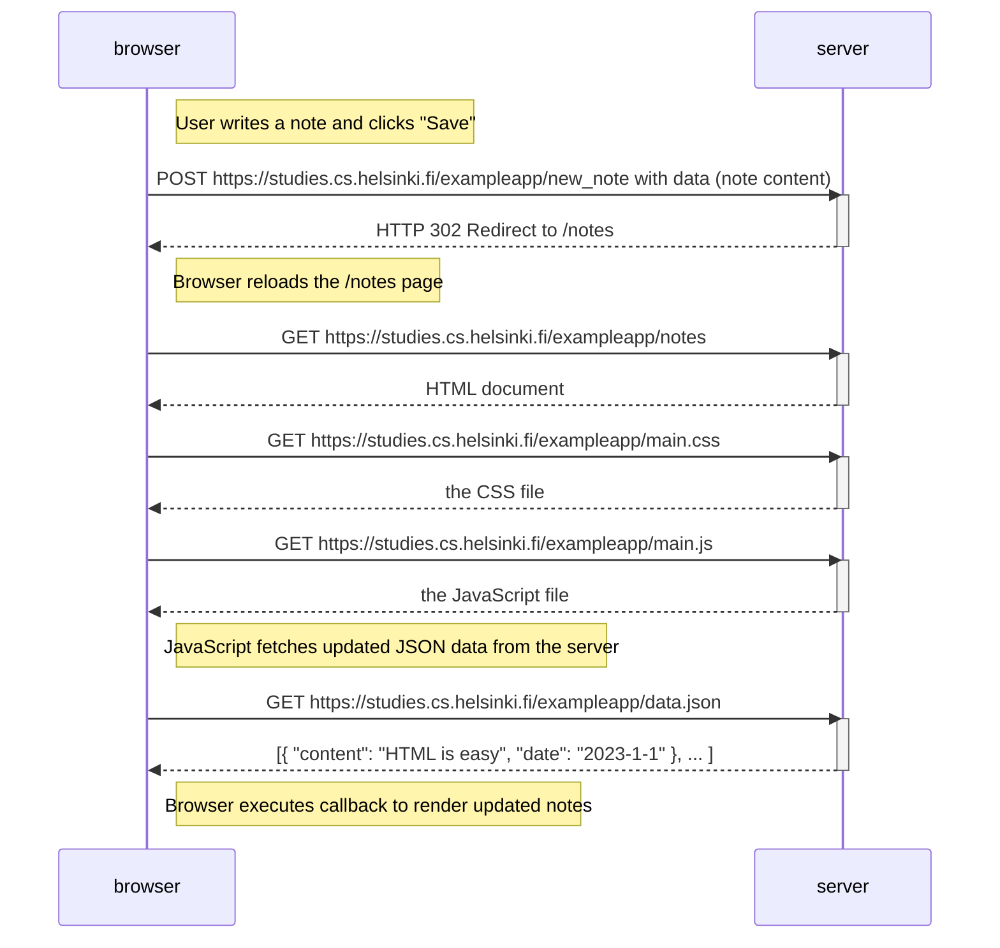
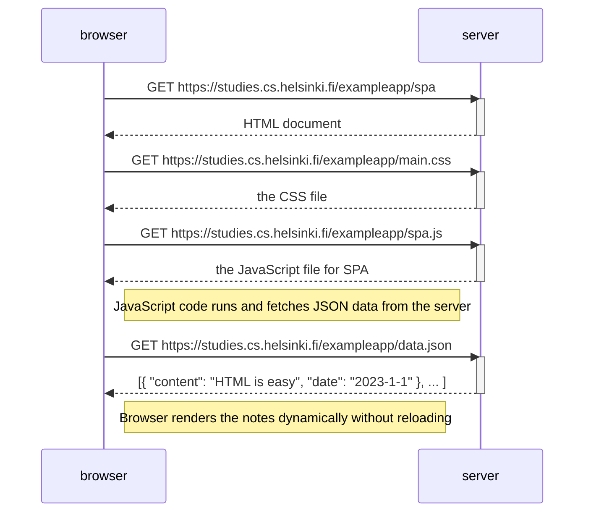
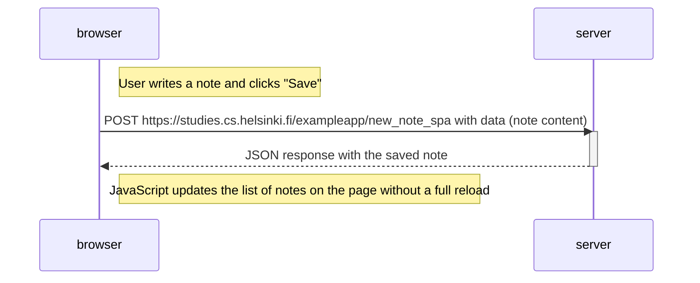

# part0

# Diagram for creating and saving a new note on the main page

# Diagram for accessing the single page application version

# Diagram for creating a new note on the single page application version

